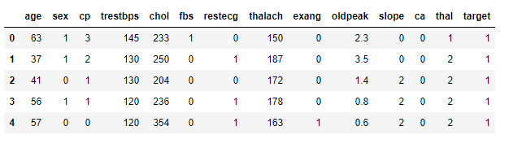
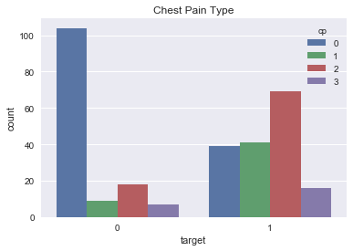
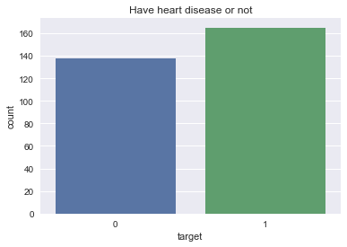

# Heart Disease
  
# Introduction  
The dataset consists of the information about people Suffering from heart disease. Various variables present in the dataset includes data of age, sex etc.  
The dataset comprises of __303 observations of 14 columns__. Below is a table showing names of all the columns and their description. 
# DATA 
| Column Name   | Description                                                    |
| ------------- | -------------                                                  | 
| age           | Age of person                                                  | 
| sex           | Sex of person male or female                                   |  
| cp            | Type of chest pain                                             | 
| trestbps      | resting blood pressure (in mm Hg on admission to the hospital  |   
| chol          | serum cholestoral in mg/dl                                     |
| fbs           | (fasting blood sugar > 120 mg/dl) (1 = true; 0 = false)        |
| restecg       | resting electrocardiographic results                           |
| thalach       | maximum heart rate achieved                                    |
| exang         | exercise induced angina (1 = yes; 0 = no)                      |
| oldpeak       | ST depression induced by exercise relative to rest             |
| slope         | the slope of the peak exercise ST segment                      |
| ca            | number of major vessels (0-3) colored by flourosopy            |
| thal          | 3 = normal; 6 = fixed defect; 7 = reversable defect            |
| target        | 1 or 0                                                         |
# Project analysis

 

