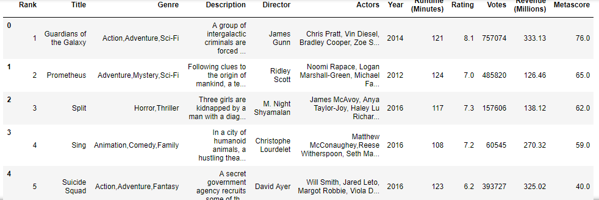
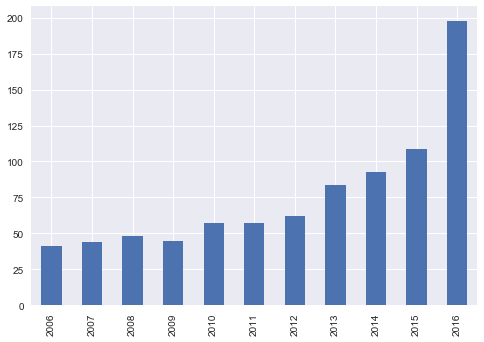
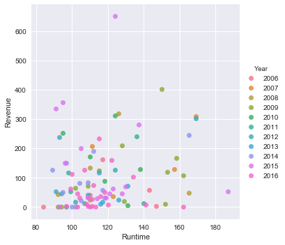

# Data-analysis-with-python

## Introdction
The dataset consists of the information about Movies released. Various variables present in the dataset includes data of Title, Director, Actors, Year, Runtime, Revenue, etc. .
The dataset comprises of 1000 observations of 12 columns. Below is a table showing names of all the columns and their description.
## Data
| Column Name   | Description                                               |
| --- |:---             | 
| Rank          | Rank of movie                                             | 
| Title         | Name of  movie                                            |  
| Genre         | Genre of movie                                            | 
| Description   | Intro about movie                                         |   
| Director      | Director of movie                                         |
| Actor         | Lead player of movie                                      |
| Year          | The year in which movie got released                      |
| Runtime       | Duration of movie                                         |
| Rating        | weightage of movie out of 10                              |
| Vote          | Number of people vited for movie                          |
| Revenue       | Amount generated by movie                                 |
| Metascore     | Score of movie on metric website                          |
## Project Analysis

Number of movies released every year

## Conclusion
Highest number of movies got released in year 2016 and graph is exponentially increasing which means industry is rising year on year
Average rating of every year seems to be almost equal but most of the movoes hav got rating above average
Larger the runtime better is the movie rating which means people love watching a good length movie
