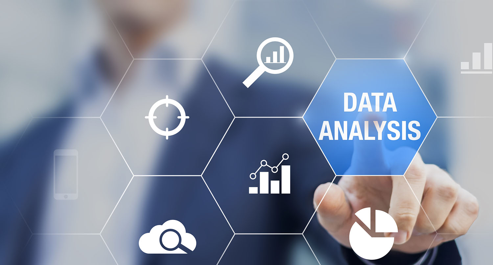

# DataAnalysisUsingPython

# What is data analysis ?                                                                                                                  The process of inspecting, cleaning, transforming and modelling data with objective of discovering usefull information, arriving at conclusion and supporting decision making process is called as data analysis.

